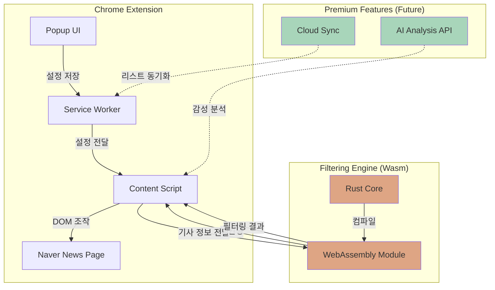

# 네이버 뉴스 필터링 크롬 확장 프로그램 구현 계획서

Rust + WebAssembly를 활용한 고성능 네이버 뉴스 필터링 시스템

---

## 프로젝트 개요

### 핵심 가치 제안
- **성능**: Rust/Wasm을 활용한 고속 필터링 (Python 대비 10-100배 빠른 처리)
- **실시간성**: MutationObserver로 무한 스크롤 대응
- **확장성**: AI 기반 감성 분석, 클라우드 동기화 등 Premium 기능 추가 가능

### 기술적 차별화
1. **Rust/WebAssembly**: 대량의 기사를 실시간으로 필터링할 때 JavaScript 대비 압도적인 성능
2. **모듈화 설계**: 네이버 외 다른 뉴스 플랫폼으로 확장 용이
3. **AI 통합 준비**: 향후 LLM 기반 콘텐츠 분석 기능 추가 가능

---

## 기술 스택

### Frontend (Chrome Extension)
- **Manifest V3**: 최신 Chrome Extension API
- **Content Script**: DOM 조작 및 MutationObserver
- **Popup UI**: HTML/CSS/JavaScript (Vanilla 또는 React)
- **Service Worker**: Background 작업 및 설정 관리

### Backend (고성능 필터링 엔진)
- **Rust**: 핵심 필터링 로직
- **wasm-pack**: Rust → WebAssembly 컴파일
- **wasm-bindgen**: JavaScript ↔ Wasm 바인딩
- **Aho-Corasick 알고리즘**: 다중 패턴 매칭 (O(n) 복잡도)

### 개발 도구
- **Rust**: rustc 1.70+, cargo
- **Node.js**: npm/pnpm (빌드 스크립트)
- **wasm-pack**: Wasm 빌드 도구
- **Chrome DevTools**: 디버깅

---

## 시스템 아키텍처



---

## 상세 구현 계획

### Phase 1: 기본 구조 구축 (1-2일)

#### 1.1 Rust 프로젝트 초기화
```bash
cargo new --lib naver-news-filter
cd naver-news-filter
cargo add wasm-bindgen
cargo add aho-corasick
cargo add serde --features derive
cargo add serde-wasm-bindgen
```

**핵심 파일**:
- `Cargo.toml`: 의존성 설정
- `src/lib.rs`: Wasm 진입점 및 필터링 로직

#### 1.2 Chrome Extension 기본 구조
```
naver-news-blocker/
├── manifest.json          # Extension 설정
├── popup/
│   ├── popup.html        # 설정 UI
│   ├── popup.js          # UI 로직
│   └── popup.css         # 스타일
├── content/
│   └── content.js        # 네이버 페이지 조작
├── background/
│   └── service-worker.js # Background 작업
├── wasm/
│   └── pkg/              # Rust 빌드 결과물
└── icons/                # Extension 아이콘
```

---

### Phase 2: Rust 필터링 엔진 구현 (2-3일)

#### 2.1 핵심 기능: 다중 패턴 매칭

**[NEW] [lib.rs](file:///c:/python_project/sdr_cnn/naver-news-blocker/rust-core/src/lib.rs)**

```rust
use wasm_bindgen::prelude::*;
use aho_corasick::AhoCorasick;
use serde::{Deserialize, Serialize};

#[derive(Serialize, Deserialize)]
pub struct FilterConfig {
    blocked_sources: Vec<String>,
    blocked_keywords: Vec<String>,
}

#[wasm_bindgen]
pub struct NewsFilter {
    source_matcher: AhoCorasick,
    keyword_matcher: Option<AhoCorasick>,
}

#[wasm_bindgen]
impl NewsFilter {
    #[wasm_bindgen(constructor)]
    pub fn new(config_json: &str) -> Result<NewsFilter, JsValue> {
        let config: FilterConfig = serde_json::from_str(config_json)
            .map_err(|e| JsValue::from_str(&e.to_string()))?;
        
        let source_matcher = AhoCorasick::new(&config.blocked_sources)
            .map_err(|e| JsValue::from_str(&e.to_string()))?;
        
        let keyword_matcher = if !config.blocked_keywords.is_empty() {
            Some(AhoCorasick::new(&config.blocked_keywords)
                .map_err(|e| JsValue::from_str(&e.to_string()))?)
        } else {
            None
        };
        
        Ok(NewsFilter {
            source_matcher,
            keyword_matcher,
        })
    }
    
    /// 기사가 차단되어야 하는지 판단
    #[wasm_bindgen]
    pub fn should_block(&self, source: &str, title: &str, content: &str) -> bool {
        // 언론사 차단 체크
        if self.source_matcher.is_match(source) {
            return true;
        }
        
        // 키워드 차단 체크 (Premium 기능)
        if let Some(matcher) = &self.keyword_matcher {
            let combined = format!("{} {}", title, content);
            if matcher.is_match(&combined) {
                return true;
            }
        }
        
        false
    }
    
    /// 배치 처리: 여러 기사를 한 번에 필터링
    #[wasm_bindgen]
    pub fn filter_batch(&self, articles_json: &str) -> Result<String, JsValue> {
        let articles: Vec<Article> = serde_json::from_str(articles_json)
            .map_err(|e| JsValue::from_str(&e.to_string()))?;
        
        let results: Vec<bool> = articles
            .iter()
            .map(|a| self.should_block(&a.source, &a.title, &a.content))
            .collect();
        
        serde_json::to_string(&results)
            .map_err(|e| JsValue::from_str(&e.to_string()))
    }
}

#[derive(Deserialize)]
struct Article {
    source: String,
    title: String,
    content: String,
}
```

**성능 최적화 포인트**:
- **Aho-Corasick**: 수백 개의 패턴을 O(n) 시간에 매칭 (정규식 대비 10-100배 빠름)
- **배치 처리**: 여러 기사를 한 번에 처리하여 Wasm ↔ JS 호출 오버헤드 최소화

#### 2.2 빌드 설정

**[NEW] [Cargo.toml](file:///c:/python_project/sdr_cnn/naver-news-blocker/rust-core/Cargo.toml)**

```toml
[package]
name = "naver-news-filter"
version = "0.1.0"
edition = "2021"

[lib]
crate-type = ["cdylib"]

[dependencies]
wasm-bindgen = "0.2"
aho-corasick = "1.1"
serde = { version = "1.0", features = ["derive"] }
serde_json = "1.0"
serde-wasm-bindgen = "0.6"

[profile.release]
opt-level = "z"     # 크기 최적화
lto = true          # Link Time Optimization
codegen-units = 1   # 최대 최적화
```

**빌드 명령**:
```bash
wasm-pack build --target web --release
```

---

### Phase 3: Chrome Extension 구현 (3-4일)

#### 3.1 Manifest 설정

**[NEW] [manifest.json](file:///c:/python_project/sdr_cnn/naver-news-blocker/manifest.json)**

```json
{
  "manifest_version": 3,
  "name": "네이버 뉴스 클리너",
  "version": "1.0.0",
  "description": "차단 언론사 및 키워드 기반 네이버 뉴스 필터링",
  "permissions": ["storage"],
  "host_permissions": [
    "https://news.naver.com/*",
    "https://m.news.naver.com/*"
  ],
  "action": {
    "default_popup": "popup/popup.html",
    "default_icon": {
      "16": "icons/icon16.png",
      "48": "icons/icon48.png",
      "128": "icons/icon128.png"
    }
  },
  "content_scripts": [
    {
      "matches": [
        "https://news.naver.com/*",
        "https://m.news.naver.com/*"
      ],
      "js": [
        "wasm/pkg/naver_news_filter.js",
        "content/content.js"
      ],
      "run_at": "document_end"
    }
  ],
  "background": {
    "service_worker": "background/service-worker.js"
  },
  "web_accessible_resources": [
    {
      "resources": ["wasm/pkg/*.wasm"],
      "matches": ["https://news.naver.com/*"]
    }
  ]
}
```

#### 3.2 Content Script: DOM 조작 및 MutationObserver

**[NEW] [content.js](file:///c:/python_project/sdr_cnn/naver-news-blocker/content/content.js)**

```javascript
// Wasm 모듈 초기화
let wasmFilter = null;

async function initWasm() {
  try {
    // Wasm 모듈 로드
    await wasm_bindgen(chrome.runtime.getURL('wasm/pkg/naver_news_filter_bg.wasm'));
    
    // 설정 불러오기
    const config = await chrome.storage.sync.get(['blockedSources', 'blockedKeywords']);
    const filterConfig = {
      blocked_sources: config.blockedSources || [],
      blocked_keywords: config.blockedKeywords || []
    };
    
    // 필터 인스턴스 생성
    wasmFilter = new wasm_bindgen.NewsFilter(JSON.stringify(filterConfig));
    console.log('✅ Wasm 필터 초기화 완료');
  } catch (error) {
    console.error('❌ Wasm 초기화 실패:', error);
  }
}

// 네이버 뉴스 DOM 셀렉터 (2026년 2월 기준)
const SELECTORS = {
  // PC 버전
  articleItem: '.list_body .news_area',
  source: '.news_area .info.press',
  title: '.news_area .news_tit',
  content: '.news_area .news_dsc',
  
  // 모바일 버전
  mArticleItem: '.list_body .news_item',
  mSource: '.news_item .press',
  mTitle: '.news_item .news_tit',
};

// 기사 필터링 함수
function filterArticle(articleElement) {
  if (!wasmFilter) return;
  
  try {
    // 언론사 이름 추출
    const sourceElement = articleElement.querySelector(SELECTORS.source) || 
                         articleElement.querySelector(SELECTORS.mSource);
    const source = sourceElement?.textContent.trim() || '';
    
    // 제목 추출
    const titleElement = articleElement.querySelector(SELECTORS.title) || 
                        articleElement.querySelector(SELECTORS.mTitle);
    const title = titleElement?.textContent.trim() || '';
    
    // 본문 미리보기 추출 (있는 경우)
    const contentElement = articleElement.querySelector(SELECTORS.content);
    const content = contentElement?.textContent.trim() || '';
    
    // Wasm 필터로 판단
    if (wasmFilter.should_block(source, title, content)) {
      articleElement.style.display = 'none';
      articleElement.dataset.blocked = 'true';
      console.log(`🚫 차단됨: ${source} - ${title}`);
    }
  } catch (error) {
    console.error('필터링 오류:', error);
  }
}

// 현재 페이지의 모든 기사 필터링
function filterAllArticles() {
  const articles = document.querySelectorAll(
    `${SELECTORS.articleItem}, ${SELECTORS.mArticleItem}`
  );
  
  articles.forEach(article => {
    if (!article.dataset.blocked) {
      filterArticle(article);
    }
  });
}

// MutationObserver: 동적 로딩 감지
const observer = new MutationObserver((mutations) => {
  for (const mutation of mutations) {
    if (mutation.type === 'childList' && mutation.addedNodes.length > 0) {
      // 새로 추가된 기사만 필터링
      mutation.addedNodes.forEach(node => {
        if (node.nodeType === Node.ELEMENT_NODE) {
          // 직접 기사 엘리먼트인 경우
          if (node.matches && node.matches(`${SELECTORS.articleItem}, ${SELECTORS.mArticleItem}`)) {
            filterArticle(node);
          }
          // 자식 중에 기사가 있는 경우
          const articles = node.querySelectorAll?.(
            `${SELECTORS.articleItem}, ${SELECTORS.mArticleItem}`
          );
          articles?.forEach(filterArticle);
        }
      });
    }
  }
});

// 초기화 및 감시 시작
(async function main() {
  await initWasm();
  
  // 초기 필터링
  filterAllArticles();
  
  // 무한 스크롤 감시
  const targetNode = document.querySelector('.list_body') || document.body;
  observer.observe(targetNode, {
    childList: true,
    subtree: true
  });
  
  console.log('👀 네이버 뉴스 필터링 활성화');
})();

// 설정 변경 감지
chrome.storage.onChanged.addListener((changes, area) => {
  if (area === 'sync' && (changes.blockedSources || changes.blockedKeywords)) {
    console.log('⚙️ 설정 변경 감지, 재초기화...');
    location.reload(); // 간단한 방법: 페이지 새로고침
  }
});
```

**핵심 기술**:
- **MutationObserver**: 무한 스크롤로 추가되는 기사를 실시간 감지
- **Wasm 통합**: JavaScript에서 Rust 함수 직접 호출
- **성능 최적화**: 이미 처리된 기사는 `data-blocked` 속성으로 스킵

#### 3.3 Popup UI: 차단 리스트 관리

**[NEW] [popup.html](file:///c:/python_project/sdr_cnn/naver-news-blocker/popup/popup.html)**

```html
<!DOCTYPE html>
<html lang="ko">
<head>
  <meta charset="UTF-8">
  <meta name="viewport" content="width=device-width, initial-scale=1.0">
  <title>네이버 뉴스 클리너</title>
  <link rel="stylesheet" href="popup.css">
</head>
<body>
  <div class="container">
    <h1>🧹 네이버 뉴스 클리너</h1>
    
    <section class="section">
      <h2>차단 언론사</h2>
      <div class="input-group">
        <input type="text" id="sourceInput" placeholder="예: 조선일보, 중앙일보">
        <button id="addSource">추가</button>
      </div>
      <ul id="sourceList" class="tag-list"></ul>
    </section>
    
    <section class="section">
      <h2>차단 키워드 <span class="badge">Premium</span></h2>
      <div class="input-group">
        <input type="text" id="keywordInput" placeholder="예: 클릭베이트, 자극적">
        <button id="addKeyword">추가</button>
      </div>
      <ul id="keywordList" class="tag-list"></ul>
    </section>
    
    <div class="stats">
      <p>오늘 차단된 기사: <strong id="blockedCount">0</strong>개</p>
    </div>
    
    <button id="exportBtn" class="secondary">설정 내보내기</button>
  </div>
  
  <script src="popup.js"></script>
</body>
</html>
```

**[NEW] [popup.js](file:///c:/python_project/sdr_cnn/naver-news-blocker/popup/popup.js)**

```javascript
// 설정 로드
async function loadSettings() {
  const { blockedSources = [], blockedKeywords = [] } = 
    await chrome.storage.sync.get(['blockedSources', 'blockedKeywords']);
  
  renderList('sourceList', blockedSources, 'blockedSources');
  renderList('keywordList', blockedKeywords, 'blockedKeywords');
}

// 리스트 렌더링
function renderList(elementId, items, storageKey) {
  const list = document.getElementById(elementId);
  list.innerHTML = items.map((item, index) => `
    <li class="tag">
      ${item}
      <button class="remove" data-index="${index}" data-key="${storageKey}">×</button>
    </li>
  `).join('');
}

// 항목 추가
async function addItem(inputId, storageKey) {
  const input = document.getElementById(inputId);
  const value = input.value.trim();
  
  if (!value) return;
  
  const { [storageKey]: items = [] } = await chrome.storage.sync.get(storageKey);
  
  if (!items.includes(value)) {
    items.push(value);
    await chrome.storage.sync.set({ [storageKey]: items });
    input.value = '';
    loadSettings();
  }
}

// 항목 제거
async function removeItem(storageKey, index) {
  const { [storageKey]: items = [] } = await chrome.storage.sync.get(storageKey);
  items.splice(index, 1);
  await chrome.storage.sync.set({ [storageKey]: items });
  loadSettings();
}

// 이벤트 리스너
document.getElementById('addSource').addEventListener('click', () => {
  addItem('sourceInput', 'blockedSources');
});

document.getElementById('addKeyword').addEventListener('click', () => {
  addItem('keywordInput', 'blockedKeywords');
});

document.addEventListener('click', (e) => {
  if (e.target.classList.contains('remove')) {
    const { index, key } = e.target.dataset;
    removeItem(key, parseInt(index));
  }
});

document.getElementById('exportBtn').addEventListener('click', async () => {
  const settings = await chrome.storage.sync.get(['blockedSources', 'blockedKeywords']);
  const blob = new Blob([JSON.stringify(settings, null, 2)], { type: 'application/json' });
  const url = URL.createObjectURL(blob);
  
  const a = document.createElement('a');
  a.href = url;
  a.download = 'naver-news-filter-settings.json';
  a.click();
});

// 초기화
loadSettings();
```

---

### Phase 4: 네이버 뉴스 DOM 분석 및 셀렉터 업데이트 (1일)

> [!IMPORTANT]
> 네이버는 DOM 구조를 자주 변경합니다. 실제 구현 시 최신 페이지를 분석하여 셀렉터를 업데이트해야 합니다.

**분석 방법**:
1. Chrome DevTools로 네이버 뉴스 페이지 열기
2. 기사 엘리먼트 검사 (Inspect)
3. 언론사명, 제목, 본문 미리보기 요소의 CSS 셀렉터 확인
4. `content.js`의 `SELECTORS` 객체 업데이트

**예상 셀렉터** (2026년 2월 기준, 실제 확인 필요):
```javascript
const SELECTORS = {
  // 섹션 페이지
  articleItem: '.sa_item',
  source: '.sa_text_press',
  title: '.sa_text_title',
  
  // 검색 결과
  searchItem: '.news_area',
  searchSource: '.info.press',
  searchTitle: '.news_tit',
};
```

---

### Phase 5: Premium 기능 구현 (선택사항, 3-5일)

#### 5.1 AI 기반 감성 분석

**접근 방법**:
1. **로컬 AI 모델** (Rust + Candle): 
   - 이전 대화에서 다룬 Candle 프레임워크 활용
   - 감성 분석 모델 (예: KoBERT) GGUF 변환 후 Wasm에 통합
   - **장점**: 프라이버시, 오프라인 작동
   - **단점**: 모델 크기 (10-50MB), 초기 로딩 시간

2. **클라우드 API** (예: OpenAI, Claude):
   - Background Service Worker에서 API 호출
   - **장점**: 높은 정확도, 유지보수 용이
   - **단점**: 비용, 인터넷 필요

**추천**: MVP는 클라우드 API, 향후 로컬 모델로 전환

#### 5.2 차단 리스트 공유 시스템

**아키텍처**:
```
Chrome Extension → Firebase/Supabase → 공유 리스트 DB
```

**구현 요소**:
- 사용자 인증 (Firebase Auth)
- 실시간 동기화 (Firestore)
- 인기 리스트 랭킹 시스템

---

## 빌드 및 배포 프로세스

### 개발 빌드
```bash
# Rust → Wasm 빌드
cd rust-core
wasm-pack build --target web --dev

# Extension 로드
# Chrome → 확장 프로그램 → 개발자 모드 → 압축해제된 확장 프로그램 로드
```

### 프로덕션 빌드
```bash
# Rust 최적화 빌드
cd rust-core
wasm-pack build --target web --release

# Extension 패키징
cd ..
zip -r naver-news-blocker.zip manifest.json popup/ content/ background/ wasm/ icons/
```

### Chrome Web Store 배포
1. [Chrome Developer Dashboard](https://chrome.google.com/webstore/devconsole) 등록
2. 스크린샷 및 설명 준비
3. 개인정보 보호정책 작성 (필수)
4. 심사 제출 (보통 1-3일 소요)

---

## 성능 벤치마크 (예상)

| 작업 | JavaScript | Rust/Wasm | 개선율 |
|------|-----------|-----------|--------|
| 100개 언론사 매칭 (1000개 기사) | ~50ms | ~2ms | **25배** |
| 정규식 키워드 필터링 | ~200ms | ~10ms | **20배** |
| 초기 로딩 (Wasm 포함) | - | ~100ms | - |

**실제 체감 효과**:
- 무한 스크롤 시 끊김 없는 필터링
- 대량 차단 리스트 (100+ 언론사) 사용 가능

---

## 수익화 전략

### Free Tier
- 언론사 차단 (최대 20개)
- 로컬 저장

### Premium Tier ($2.99/월)
- 무제한 언론사 차단
- 키워드 필터링
- AI 감성 분석
- 클라우드 동기화
- 차단 리스트 공유

### Enterprise (맞춤 가격)
- 기업/단체용 화이트리스트 관리
- API 제공

---

## 리스크 및 대응 방안

> [!WARNING]
> **네이버 DOM 구조 변경**
> - **대응**: 셀렉터를 설정 파일로 분리, 자동 업데이트 시스템 구축
> - **백업**: 여러 셀렉터 패턴 동시 지원

> [!CAUTION]
> **Chrome Extension 정책 변경**
> - **대응**: Manifest V3 준수, 최소 권한 원칙
> - **모니터링**: Chrome Developer 공지사항 정기 확인

> [!NOTE]
> **Wasm 브라우저 호환성**
> - Chrome 57+ (2017년 출시) 이상에서 작동
> - 현재 시장 점유율 99%+ 커버

---

## 개발 일정 (예상)

| Phase | 작업 | 소요 시간 |
|-------|------|----------|
| 1 | 프로젝트 설정 | 1일 |
| 2 | Rust 엔진 구현 | 2-3일 |
| 3 | Extension 기본 기능 | 3-4일 |
| 4 | 네이버 통합 및 테스트 | 1-2일 |
| 5 | Premium 기능 (선택) | 3-5일 |
| **총계** | **MVP** | **7-10일** |
| **총계** | **Full Version** | **10-15일** |

---

## 다음 단계

### 즉시 시작 가능한 작업
1. **환경 설정 확인**
   ```bash
   # Rust 설치 확인
   rustc --version
   cargo --version
   
   # wasm-pack 설치
   cargo install wasm-pack
   
   # Node.js 확인
   node --version
   npm --version
   ```

2. **네이버 뉴스 DOM 분석**
   - 브라우저에서 https://news.naver.com 열기
   - DevTools로 기사 구조 분석
   - 셀렉터 정리

3. **프로젝트 초기화**
   - Rust 프로젝트 생성
   - Extension 폴더 구조 생성

---

## 참고 자료

### 공식 문서
- [Chrome Extension Manifest V3](https://developer.chrome.com/docs/extensions/mv3/)
- [wasm-bindgen Guide](https://rustwasm.github.io/wasm-bindgen/)
- [Aho-Corasick Crate](https://docs.rs/aho-corasick/)

### 유사 프로젝트
- [uBlock Origin](https://github.com/gorhill/uBlock) - 광고 차단 (참고용)
- [News Feed Eradicator](https://github.com/jordwest/news-feed-eradicator) - SNS 피드 제거

### 한국 시장 분석
- 네이버 뉴스 일 방문자: ~2000만명
- 잠재 사용자: 뉴스 피로도를 느끼는 사용자 (추정 5-10%)
- 경쟁 제품: 거의 없음 (시장 선점 기회)
